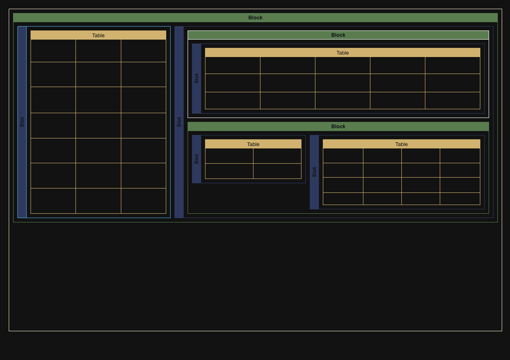
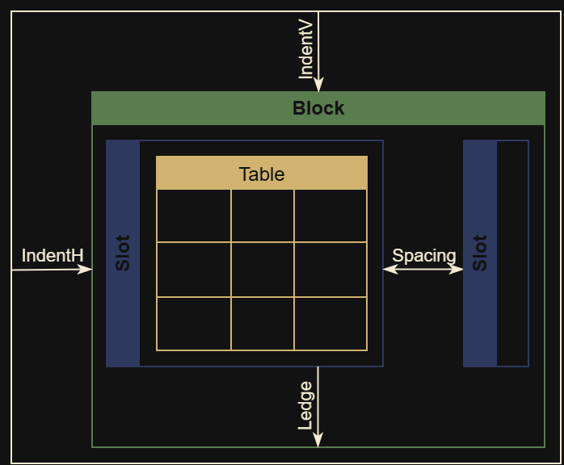

# PDFEGO
PDFEGO — это конструктор файлов PDF на GO. Конструктор имеет блочную структуру, сводящейся в конечной точке к заполнению таблиц.
Инструментарий разработан для проектирования документов и их динамического заполнения.
Создав один шаблон, можно передавать в него новые текстовые данные, и макет подстроится под них.

## Структура


Структура представляет собой упорядоченные блоки, каждый выполняющий свою функцию:
* Блоки `Block` представляют собой контейнеры, содержащие слоты `Slot`.
Особенность блоков в том, что они располагаются вертикально друг за другом.
Блоки слегка отличаются по поведению в зависимости от родителя.
Блоки созданные от конструктора неделимы: если блок не помещается на страницу, он перенесется на следующую.
При инициализации такого блока предыдущий будет записан в буфер страницы и изменить его будет нельзя.
* Слоты `Slot` — это контейнеры, располагающиеся горизонтально друг за другом.
Слоты могут содержать либо блоки, либо одну таблицу `Table`. Настройки для блоков и для слотов идентичны.
* Таблицы `Table` — это таблицы в классическом понимании. Состоят из ячеек и имеют жесткую сетку по строкам и колонкам.

Параметры этих трех контейнеров практически идентичны. Вот основные:

* IndentH, IndentV — отступы от родительского контейнера по-горизонтали и по-вертикали соответственно.
* Ledge — выступ контейнера. Считается его частью, поэтому высота и границы будут учитывать выступ.
* Spacing (SpacingH, SpacingV) — пространство между дочерними контейнерами.
Для таблицы существует разделение для отдельной настройки расстояния между строками и между колонками.

## Quick start
```

```